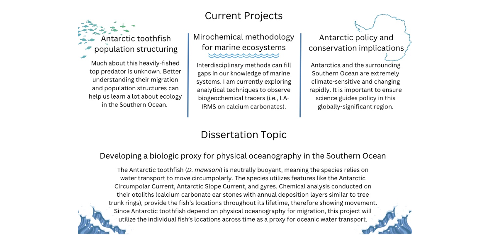

  
### hayley.kwasniewski@colorado.edu | LinkedIn: HayleyKwas | GitHub: hayleykwas

***

### *Investigating how anthropogenic activities affect the Antarctic, a region of significant global climate regulation, biodiversity, and resource extraction.*
  
I am a PhD student in the Environmental Studies Department at the University of Colorado-Boulder. After researching biochemical and cellular development of cancer, I began following an interest in the environmental fields. Before returning to academica, I worked at the interface of grassroots movements, climate resilience, and policy. From this experience, I gained a deep appreciation for nonhuman species and what they could tell us about ecosystem health, human impacts, and climate change. During my M.S. in environmental science and policy at Johns Hopkins University, I studied the relationships between environemtnal injustice and pollinator populations. My unique set of experiences now provides me with the foundation necessary to answer questions about the Southern Ocean. I am excited to apply my chemistry, conservation, and policy knowledge to Antarctic toothfish research. I am particularly interested in learning about physical oceanography and ecology of the Southern Ocean from this the keystone species.

***

## More About Me
For more detailed information, feel free to contact me via email.

### Education
2028		Ph.D., Environmental Studies, University of Colorado Boulder

2024		Certificate, Data Analysis with R, Duke University

2023		M.S., Environmental Policy and Science, Johns Hopkins University

2019		B.A., Biochemistry, Minors: Gender Studies, Geological Sciences, Indiana University

### Experience
*Scientific Research*

2023-2028	   University of Colorado. Boulder, CO. Research Assistant on National Science Foundation CAREER Grant Project: Using otolith chemistry to reveal the life history of Antarctic toothfish in the Ross Sea, Antarctica: Testing fisheries and climate change impacts on a top fish predator. 

2024	       Universidad de Chile Austral. Puerto Montt, Chile. Visiting Scholar.

2021-2023    Johns Hopkins University. Baltimore, MD. Graduate Research Assistant. 

2020	       Lew Farms. Mancos, CO. Sustainable Garlic Farming in Southwest CO: understanding drought and resource scarcity. Research Technician.

2015-2017	   Indiana University Department of Biochemistry. Bloomington, IN. Undergraduate Research Assistant.

*Affiliations*

2023-	       Graduate Research Assistant, Institute of Arctic and Alpine Research, CU Boulder

*Community-based Environmental Outreach and Policymaking*

2021-2023	   The Park People. Denver, CO. Development Manager.

2020-2021	   Mancos Conservation District. Crew Mancos, CO. Development and Outreach Associate.

2019-2020	   Mancos Conservation District. Mancos, CO. AmeriCorps VISTA.

2018		     Global Water Brigades. Managua, Nicaragua. Crew Leader. 

2017	       Positive Link. Bloomington, IN. Public Health Policy Intern.

2015	       GlobalMindED. Denver, CO. Environmental Research Intern.

### Service and Leadership

*Professional service within the University of Colorado, Boulder*

2023-present	Graduate Student Representative, Justice, Equity, Diversity, and Inclusivity Committee, Environmental Studies Department.

2024-present	Convenor, First Gen to College Affinity Group, Environmental Studies Department.

2023		      Research Assistant Volunteer, STEAM Family Fest, Institute for Arctic and Alpine Research.

2023	Graduate Student Panelist, Investigating Careers in the Environment, Environmental Studies Department.

*Professional service outside of the University of Colorado*

2023-present	Program Committee Chair, Johns Hopkins University Sustainability Leadership Alumni 			Association Retreat. Estes Park, CO.

2024-2025	Event Supervisor, Science Olympiad, Fort Collins, CO.

2022-2023	Program Committee Member, Johns Hopkins University Sustainability Leadership 			Alumni Association Retreat. Fredrick, MD.

2021-2022	Co-President, Young Professionals Inclusive Leadership Council, GlobalMindED, Denver, CO.

